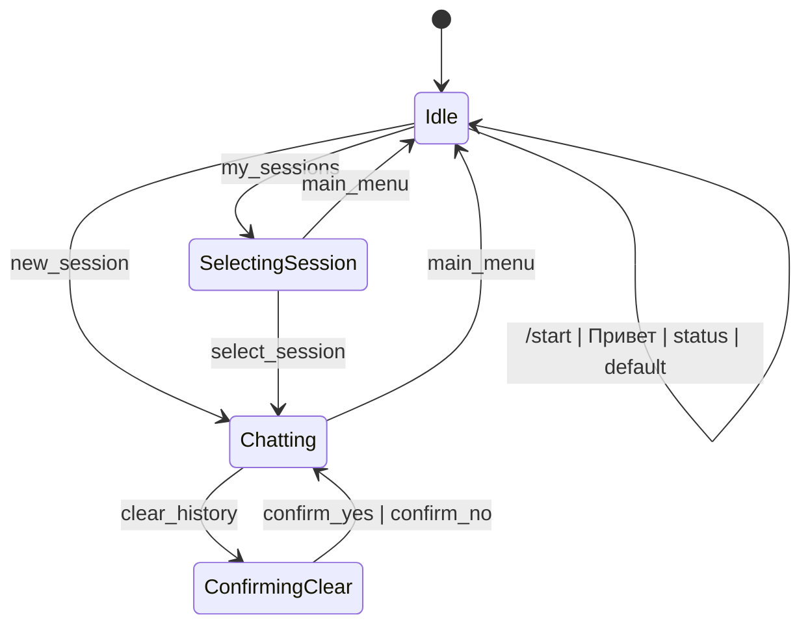

# hermes-vk-bot

VK-бот для Hermes Agent через сообщения сообщества ВКонтакте.

Бот:
- получает входящие сообщения из VK Long Poll API;
- ведет диалоги с Hermes Agent;
- хранит историю диалогов в SQLite;
- восстанавливает состояние пользователя после перезапуска;
- ограничивает доступ через белый список пользователей.

## Возможности

- Главное меню с кнопками:
  - Новый диалог
  - Мои диалоги
  - Статус Hermes
- Хранение нескольких сессий диалога и выбор нужной сессии.
- Очистка истории текущего диалога с подтверждением.
- Индикация "печатает..." во время ожидания ответа Hermes.
- Устойчивость к временным сетевым ошибкам VK API (ретраи).

## Архитектура состояний

Бот работает как конечный автомат состояний.



## Требования

- Ruby 3.4.0 (см. `.ruby-version`)
- Bundler
- Доступный Hermes Agent по HTTP
- Сообщество VK с включенными сообщениями и Long Poll API

## Быстрый старт

1. Установить зависимости:

	```bash
	bundle install
	```

2. Создать `.env` в корне проекта.

3. Заполнить обязательные переменные окружения (пример ниже).

4. Запустить бота:

	```bash
	bundle exec ruby bin/bot
	```

5. Открыть диалог с сообществом VK и отправить `/start` или `Привет`.

## Переменные окружения

```env
VK_TOKEN=vk1.a.your_group_token
VK_GROUP_ID=123456789
ALLOWED_USERS=333222111,444555666

HERMES_URL=http://127.0.0.1:8642
HERMES_API_KEY=none

DB_PATH=bot.db
```

| Переменная | Обязательна | По умолчанию | Описание |
| --- | --- | --- | --- |
| `VK_TOKEN` | Да | - | Токен сообщества VK для API-запросов. |
| `VK_GROUP_ID` | Да | - | ID сообщества VK. |
| `ALLOWED_USERS` | Да | пусто | Список разрешенных user_id через запятую. Если пусто, бот не отвечает никому. |
| `HERMES_URL` | Нет | `http://127.0.0.1:8642` | Базовый URL Hermes Agent. |
| `HERMES_API_KEY` | Нет | `none` | Bearer-токен для Hermes API. |
| `DB_PATH` | Нет | `bot.db` | Путь к SQLite-файлу бота. |

## Настройка VK

1. Создать/выбрать сообщество VK.
2. Включить сообщения сообщества.
3. В разделе API:
	- создать токен сообщества (`VK_TOKEN`);
	- включить Long Poll API;
	- использовать версию API `5.131`.
4. Добавить в `.env` ID сообщества (`VK_GROUP_ID`).

## Hermes в WSL (Windows)

Если Hermes запущен внутри WSL, а бот в Windows, можно пробросить порт (PowerShell от имени администратора):

```powershell
$wslIp = (wsl hostname -I).Trim().Split()[0]
netsh interface portproxy add v4tov4 listenport=8642 listenaddress=127.0.0.1 connectport=8642 connectaddress=$wslIp
```

Проверить правило:

```powershell
netsh interface portproxy show all
```

Удалить правило:

```powershell
netsh interface portproxy delete v4tov4 listenport=8642 listenaddress=127.0.0.1
```

Для внешнего доступа к Hermes можно использовать Tailscale и указать его адрес в `HERMES_URL`.

## Тесты и качество кода

Запуск всех тестов:

```bash
bundle exec rspec
```

Запуск отдельного файла тестов:

```bash
bundle exec rspec spec/chat_session_spec.rb
```

Проверка стиля:

```bash
bundle exec rubocop
```

## Docker

Локальная сборка образа:

```bash
docker build -t hermes-vk-bot:local .
```

Локальный запуск контейнера:

```bash
docker run --rm --name hermes-vk-bot \
	--env-file .env \
	-e DB_PATH=/data/bot.db \
	-v "${PWD}/data:/data" \
	hermes-vk-bot:local
```

## CI/CD (GitHub Actions)

### Что настроено в репозитории

- CI: [`.github/workflows/ci.yml`](.github/workflows/ci.yml)
	- запускается на `push` и `pull_request` в ветки `main` и `develop`;
	- выполняет `bundle exec rubocop`;
	- выполняет `bundle exec rspec` (включая mock-тесты через WebMock).

- CD: [`.github/workflows/deploy.yml`](.github/workflows/deploy.yml)
	- запускается автоматически только после успешного workflow `CI` на `push` в `main`;
	- собирает Docker-образ и публикует в GHCR;
	- подключается к серверу по SSH и перезапускает контейнер.

### Какие Secrets нужны в GitHub

Добавьте в `Settings -> Secrets and variables -> Actions`:

- `DEPLOY_HOST` - адрес сервера
- `DEPLOY_USER` - SSH-пользователь на сервере
- `DEPLOY_SSH_KEY` - приватный SSH-ключ (многострочный, целиком)
- `DEPLOY_CONTAINER_NAME` - имя контейнера (например `hermes-vk-bot`)
- `DEPLOY_ENV_FILE` - путь до env-файла на сервере (например `/opt/hermes-vk-bot/.env`)
- `DEPLOY_DATA_DIR` - каталог на сервере для SQLite (например `/opt/hermes-vk-bot/data`)
- `GHCR_USERNAME` - GitHub-логин с правом читать пакеты
- `GHCR_TOKEN` - GitHub token/PAT с правом `read:packages`

### Подготовка сервера

1. Установите Docker.
2. Создайте env-файл, например `/opt/hermes-vk-bot/.env`.
3. Заполните в нем переменные:

```env
VK_TOKEN=...
VK_GROUP_ID=...
ALLOWED_USERS=...
HERMES_URL=...
HERMES_API_KEY=...
```

4. Убедитесь, что у пользователя из `DEPLOY_USER` есть право запускать `docker`.

### Как это работает в потоке разработки

1. Вы пушите изменения в `develop` -> автоматически стартует CI.
2. Открываете PR `develop -> main`.
3. После merge в `main`:
	 - снова запускается CI,
	 - при успехе автоматически запускается deploy workflow.

### Чтобы main принимал только зеленые изменения

Включите branch protection для `main`:
- `Require a pull request before merging`
- `Require status checks to pass before merging`
- выберите обязательный check: `CI / lint_and_test`

## Хранение данных

SQLite содержит три таблицы:
- `sessions` - диалоги;
- `messages` - сообщения внутри диалогов;
- `user_state` - текущее состояние пользователя и выбранная сессия.

Это позволяет поднимать бота после перезапуска без потери контекста состояния.

## Структура проекта

```text
bin/
  bot                       # точка входа
lib/
  bot.rb                    # основной цикл VK Long Poll и API VK
  hermes_client.rb          # HTTP-клиент Hermes
  chat_session.rb           # работа с SQLite
  states/
	 base_state.rb
	 idle_state.rb
	 chatting_state.rb
	 selecting_session_state.rb
	 confirming_clear_state.rb
spec/
  *_spec.rb                 # тесты RSpec
```

## Частые проблемы

1. Бот не отвечает на сообщения.
	- Проверьте, что ваш `user_id` есть в `ALLOWED_USERS`.
	- Убедитесь, что сообщение отправлено в личку сообщества, а не в беседу.

2. Сообщение "Hermes недоступен.".
	- Проверьте `HERMES_URL`.
	- Проверьте доступность `GET /health` у Hermes.

3. Ошибки соединения с VK API.
	- Убедитесь, что `VK_TOKEN` и `VK_GROUP_ID` корректны.
	- Проверьте, что Long Poll API включен.